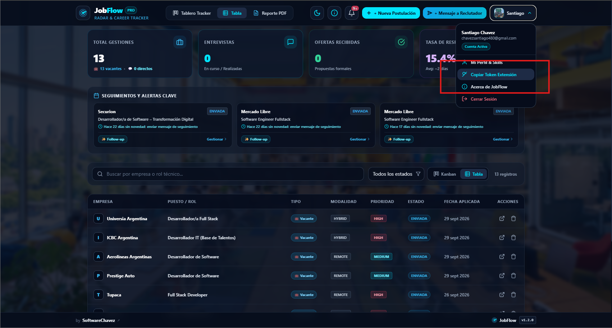

# 🧩 JobFlow — Extensión de Chrome (Manifest V3)

Extensión complementaria oficial de **JobFlow (v1.0.5)** para capturar, analizar con Inteligencia Artificial (Google Gemini) y registrar tanto ofertas laborales como perfiles de reclutadores en tu tablero Kanban con un solo clic desde cualquier portal web.

---

## ⚡ Características Principales

* **Captura Dual (Vacantes & Reclutadores):** Detecta automáticamente el contenido de la vacante abierta en portales como **LinkedIn Jobs**, **Indeed**, **BambooHR**, **Glassdoor** y sitios web generales, o el perfil de un recruiter/headhunter en LinkedIn.
* **Fallback de Selección Manual:** Si el portal tiene un diseño complejo, basta con seleccionar el texto relevante con el ratón y la extensión lo capturará con prioridad.
* **Procesamiento con Gemini AI:** 
  * Para vacantes: Extrae con precisión el nombre de la empresa, puesto, modalidad (Remoto/Híbrido/Presencial), nivel de prioridad, skills requeridas, afinidad (%) y un pitch de presentación personalizado (`origin: 'JOB_POSTING'`).
  * Para reclutadores: Genera un pitch de cold outreach magnético adaptado al rol y a tus skills de perfil (`origin: 'DIRECT_OUTREACH'`).
* **Integración Directa con la API:** Guarda la postulación o el contacto de inmediato en tu base de datos MongoDB Atlas vinculada a tu cuenta de usuario.
* **Estética Deep Cobalt & Crisp Gold:** Interfaz popup moderna y compacta con selector de entorno (Local / Producción) y almacenamiento seguro de JWT.

---

## 📁 Estructura del Módulo

```text
extension/
├── manifest.json       # Manifiesto V3 estricto con permisos mínimos (v1.0.5)
├── popup/
│   ├── popup.html      # Estructura de la interfaz de usuario
│   ├── popup.css       # Estilos temáticos Deep Cobalt & Crisp Gold
│   └── popup.js        # Lógica de conexión con content.js y API REST
├── scripts/
│   └── content.js      # Extractor contextual en capas (vacantes y perfiles)
├── assets/             # Iconos oficiales (16x16, 48x48, 128x128)
└── README.md           # Guía de instalación y uso
```

---

## 🚀 Guía de Instalación en Google Chrome

Para instalar y probar la extensión localmente en tu navegador:

1. Abre Google Chrome y escribe en la barra de direcciones:
   ```text
   chrome://extensions/
   ```
2. En la esquina superior derecha, activa el interruptor **"Modo de desarrollador"** (*Developer mode*).
3. Haz clic en el botón **"Cargar descomprimida"** (*Load unpacked*) en la esquina superior izquierda.
4. En el explorador de archivos, selecciona la carpeta `extension` ubicada en la raíz de este proyecto:
   ```text
   c:\Users\Santiago\Proyectos integradores\Jobfow-app\extension
   ```
5. ¡Listo! Verás aparecer **JobFlow — Capturador de Vacantes y Reclutadores** en tu barra de extensiones de Chrome. (Recomendado: haz clic en el icono de la pieza de rompecabezas en Chrome y "fija" la extensión para tenerla siempre a mano).

---

## ⚙️ Configuración Inicial (Vinculación con tu Cuenta)

1. **Abre el Popup de la Extensión** haciendo clic en su icono en la barra superior del navegador.
2. La extensión se conecta directamente a los servicios en la nube de **JobFlow**.
3. Haz clic en el icono de **Engranaje (⚙️)** en la esquina superior derecha del popup:
   * **Token de Autenticación (JWT):**
     * En la aplicación web de JobFlow, haz clic en tu avatar en el menú superior y pulsa **"Copiar Token Extensión"**.
     * Pega el token en el campo correspondiente del popup.
     * *(Tip: Si tienes abierta la pestaña de JobFlow Web, puedes pulsar "Detectar sesión" para que se autocomplete de inmediato).*
4. Haz clic en **"Guardar Token"**. El indicador superior cambiará a **"Conectado"** en color verde.

<p align="center">
  
</p>

---

## 🔄 Actualizar la Extensión (Si ya la tenías instalada)

Si has actualizado el código del proyecto o recibido una nueva versión:
1. Ve a `chrome://extensions/` en tu navegador.
2. Localiza la tarjeta de **JobFlow — Capturador de Vacantes y Reclutadores**.
3. Haz clic en el icono circular de **Recargar (🔄)** en la esquina inferior derecha de la tarjeta.
4. La extensión se actualizará inmediatamente a la versión más reciente (`v1.0.5`).

---

## 🎯 Cómo Usar la Extensión

1. Navega a una oferta de trabajo o al perfil de un reclutador en LinkedIn.
2. Haz clic en el icono de **JobFlow** en tu barra de extensiones.
3. Verifica que detecte la pestaña activa y haz clic en el botón dorado:
   ```text
   ⚡ Capturar y Procesar con IA
   ```
4. Observa el progreso en vivo:
   * Extracción de datos ➔ Análisis con Inteligencia Artificial ➔ Guardado directo en tu cuenta.
5. Al completarse, verás la tarjeta de resumen y la gestión ya estará visible en tu **Tablero Kanban**.

---

## 🛠️ Diagnóstico y Solución de Problemas

| Síntoma | Causa Probable | Solución |
| :--- | :--- | :--- |
| **"Sin Token" o Error 401** | No se configuró el token o expiró la sesión | Abre la app web de Jobflow, copia tu token desde el menú de perfil y pégalo en los ajustes del popup. |
| **"Texto de la vacante no detectado"** | El portal usa iframes o estructuras dinámicas no estándar | Selecciona con el ratón el texto de la vacante en la página web y vuelve a pulsar el botón en el popup. |
| **Error de conexión con los servidores** | Conectividad de red interrumpida o tiempo de espera | Verifica tu conexión a internet y pulsa **Reintentar** en el mensaje de error. |
| **Cambios no se reflejan tras actualizar código** | Chrome mantiene en caché la versión previa de la extensión | Abre `chrome://extensions/` y haz clic en el botón de recarga (🔄) de la extensión JobFlow. |
